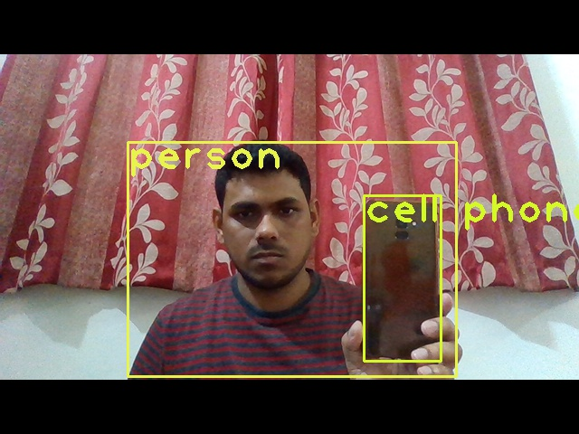
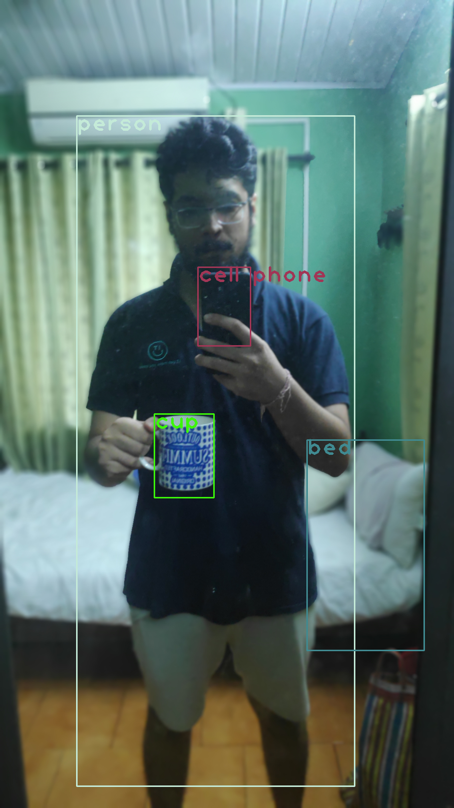

# EVA5 - WEEK 13 Assignment ( YOLO v2/V3/V4) #

# Assignment Part 1: #
OpenCV Yolo: SOURCE
Run this above code on your laptop or Colab. 
Take an image of yourself, holding another object which is there in COCO data set (search for COCO classes to learn). 
Run this image through the code above. 
Upload the link to GitHub implementation of this
Upload the annotated image by YOLO. 

Yolo Coco Dataset Weights used: https://drive.google.com/file/d/1jVuQrUVI-PtTQOUoCCMdNunP5-orayrt/view?usp=sharing

### Github link  ###
https://github.com/Anjan-AI/TSAI-EVA5/tree/master/S13/opencv_yolo

### Annotated Image by Yolo ###
https://github.com/Anjan-AI/TSAI-EVA5/blob/master/S13/opencv_yolo/Avnish/with_clock_output.png

  			  

  			  

  			  

# Assignment Part 2: Annotate Images using YoloV3 Annotation Tool #
Share your NEWLY annotated (same as 12, but annotated using new tool) images with Zoheb by Wednesday at midnight. Take the set back for training on Thursday.

Images shared by each of us as drive link via email to submissions@theschoolofai.in
e.g. https://drive.google.com/drive/folders/139QxcVNpj17H4ZMCGb7gv_jXkGl_XzMY?usp=sharing

# Assignment Part 3: Training Custom Dataset (hardhat, vest, mask & boots) on Colab for YoloV3 #

Batch Size: 16
Epochs: 120
Time taken: 6 mins per epoch, total 12 hours
Best Trained model: https://drive.google.com/file/d/1QVnbRNbT7hFaj5GrWUiqTcPIahy7AVtT/view?usp=sharing
Notebook: https://github.com/Anjan-AI/TSAI-EVA5/blob/master/S13/YoloV3_SafetyWear.ipynb

# Assignment Part 4: Run the custom model on Images derived from a Video & Create a Video showing detection of the trained subjects #

Steps to process the video for Yolo V3 detection & upload on Social media:
1. Download a sample youtube video using the mentioned tool: https://www.y2mate.com/
2. Cut the video to the duration needed, using an online tool like: https://www.onlineconverter.com/
3. Generate images from the video using ffmpeg command: ffmpeg -i video.mp4 image-%03d.jpg
4. Generate audio.mp from the video file using command: ffmpeg -i video.mp4 -f mp3 -ab 192000 -vn audio.mp3
5. Run the model with the above created images to generate inferred output images, using following command in notebook:
!python detect.py --weights 'weights/best.pt' --conf-thres 0.1 --source 'data/inferdata' --output output
Different thresholds can be tried to see the effect on outcome.
6. Convert the output images to video by running the following command in output folder:
ffmpeg -i image-%03d.jpg result.mp4
7. Add the previously saved audio to the generated video by running following command (audio.mp3 generated in step 4 is to be copied in output folder to execute this command):
ffmpeg -i result.mp4 -i audio.mp3 -shortest result_with_audio.mp4
8. Upload the video in youtube and share the same on linkedin.
Sample Youtube link: https://youtu.be/zpTqinqkXpE
Sample Linkedin link: https://www.linkedin.com/posts/avnish-midha-a734772_covid19-construction-safety-yolov3-trained-activity-6726096652433805312-6gk_

### Below is a sample inferred image ###

  			  

### Submitted By  ###
1. Avnish Midha 
2. Ramkumar M 
3. Pradipt Trivedi 
4. Anjan Kumar Patra
