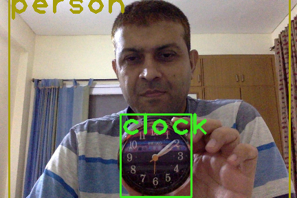
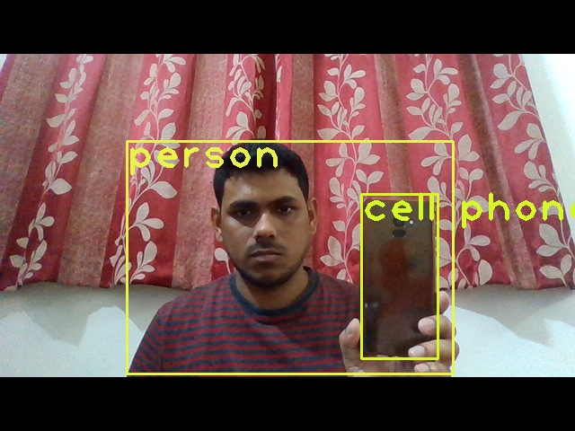
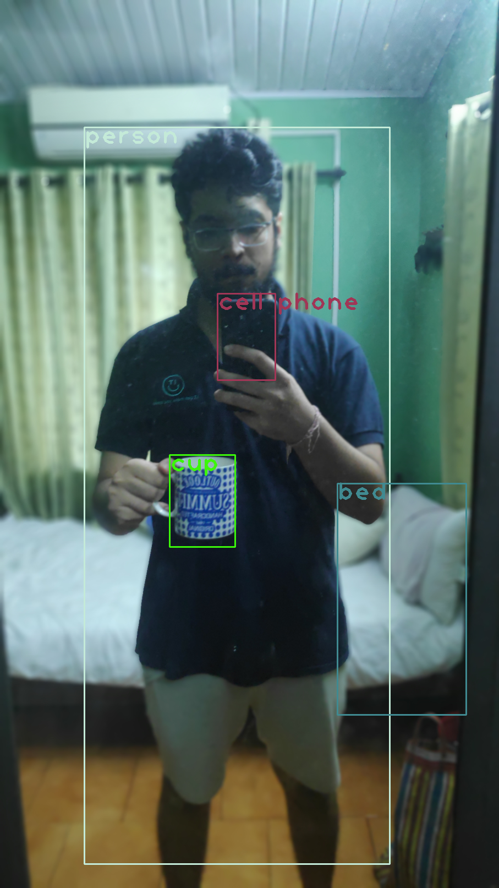

# EVA5 - WEEK 13 Assignment ( YOLO v2/V3/V4) #

# Assignment Part 1: #
OpenCV Yolo: SOURCE
Run this above code on your laptop or Colab. 
Take an image of yourself, holding another object which is there in COCO data set (search for COCO classes to learn). 
Run this image through the code above. 
Upload the link to GitHub implementation of this
Upload the annotated image by YOLO. 

Yolo Coco Dataset Weights used: https://drive.google.com/file/d/1jVuQrUVI-PtTQOUoCCMdNunP5-orayrt/view?usp=sharing

### Github link  ###
https://github.com/Anjan-AI/TSAI-EVA5/tree/master/S13/opencv_yolo

### Annotated Image by Yolo ###
https://github.com/Anjan-AI/TSAI-EVA5/blob/master/S13/opencv_yolo/Avnish/with_clock_output.png

### Below the annotated image ###

  			  

  			  

  			  

### Submitted By  ###
1. Avnish Midha 
2. Ramkumar M 
3. Pradipt Trivedi 
4. Anjan Kumar Patra
