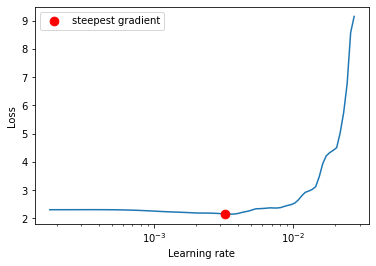

# EVA5 - WEEK 10 Assignment #

## Assignment: ##
Implement the below in the Week 9 code 
1. Implement LR Finder to find best LR
2. Implement ReduceLROnPlateau
3. Use SGD with mometum
4. Train For 50 epochs
5. Target accuracy is 88%
6. Run GradCAM on the any 25 misclassified images 

## Below are the Training Details  ##
### Parameters and Hyperparameters ###
1. Loss Function: Cross Entropy Loss 
2. Optimizer: SGD
3. Learning Rate: 0.003612342699709432 ( using LR finder)
4. momentum=0.9
5. ReduceLROnPlateau : patience = 5
6. Batch Size: 64
7. num_workers = 4 
8. Epochs: 50
9. Data Augmentation (horizontal_flip_prob=0.6,vertical_flip_prob=0.6,rotate_degree =30.0,cutout)

### The following data augmentation techniques were applied to the dataset during training: ###
Random Rotation: 30 degrees
Random Horizontal Flip
verticle Flip

### Traing and test Accuracy 
Best Training Accuracy : 89.46%
Best Test Accuracy : 88.55%

### below is the LR finder curve

  			  

### below is the results of Gradcam of misclassified images for last 2 layers of the netowrk 

  			  

### Submitted By  ###
1. Avnish Midha 
2. Ramkumar M 
3. Pradipt Trivedi 
4. Anjan Kumar Patra

