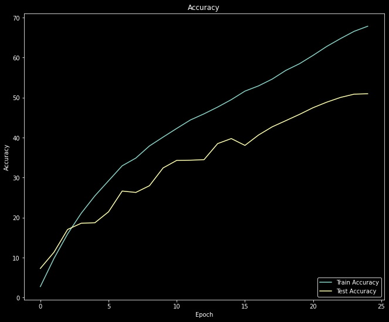
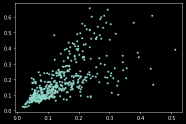
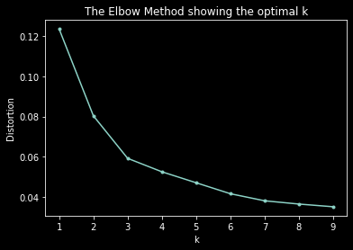
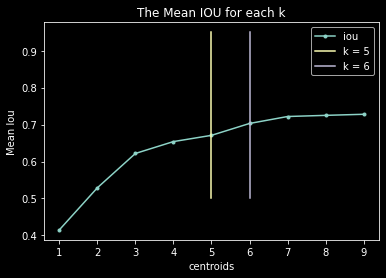
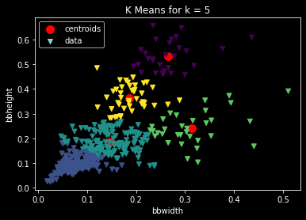
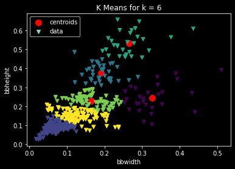

# EVA5 - WEEK 12 Assignment ( YOLO part-1) #

# Assignment A: #
1.Download this TINY IMAGENET dataset.
2.Train ResNet18 on this dataset (70/30 split) for 50 Epochs. Target 50%+ Validation Accuracy.

### Below are the Training Details  ###
 Parameters and Hyperparameters
1. Loss Function: Cross Entropy Loss
2. Optimizer: SGD
3. Batch Size: 256
4. num_workers = 8
4. momentum=0.9
5. useed LR finder suggested LR is 0.06 . Baed on exp kept the max LR at 0.01
6. Epochs: 25
7. Data Augmentation : PadIfNeeded,RandomCrop,Rotation,HorizontalFlip,RGBShift,Cutout
8. Used OneCycleLR from pytorch API as the scheduler .
9. max_lr = 0.01
10. div_factor=10, final_div_factor=10

### Traing and test Accuracy
Best Training Accuracy : 67.86%
Best Test Accuracy : 50.97%

### below is the LR finder curve

  			  

### below is Training and validation ( test)  accuracy curve

  			  

# Assignment B: #

1. Download 50 (min) images each of people wearing hardhat, vest, mask and boots.
2. Use these labels (same spelling and small letters):
  hardhat
  vest
  mask
  boots
3. Use VGG annotator Tool to  annotate bounding boxes around the hardhat, vest, mask and boots.
4. Download JSON file.
5. Describe the contents of this JSON file in FULL details (you don't need to describe all 10 instances, anyone would work).
6. Write ocde to find the best no of anchor points (K) for the dataset using elbow method and IOU method.

## Visualisation of data ##

  			  

## Elbow method to find out K ##

  			  

## IOU method to find out K ##

  			  

## K means with k = 5 ##

  			  

## K means with k = 6 ##

  			  

### Submitted By  ###
1. Avnish Midha
2. Ramkumar M
3. Pradipt Trivedi
4. Anjan Kumar Patra
