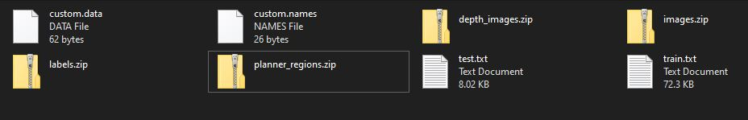

# EVA5 - Assignment 15A  #

1. Look at this model: https://github.com/intel-isl/MiDaS (Links to an external site.)
2. Look at this model: https://github.com/NVlabs/planercnn
3. Now you have your helmet, mask, PPE, and boots dataset as well
4. Take your dataset and run it through Midas and get depth images.
5. Take your dataset and run it through the PlanerCNN model and get planer images (you'll not be using the depth images from PlanerCNN, so don't store them). 
6. Now your dataset contains depth map, surface planes, and bounding boxes for the classes
7. Upload to your google drive with a shareable link to everyone, and add a GitHub repo that describes the dataset properly.

### Google Drive Link to the Groudtruth data ###
https://drive.google.com/drive/folders/1_Fuz23akKdzqQnRGnbY4zDI9Yerjw918

## Dataset organisation ##

total no of Images used for GT : 3475
### Below is folder structure ###

  			  

### the folder details are as below ###
1. images : contails the JPG images used for annotations. the images are named in sequence. 
2. labels : contains a .txt file coresponding to each images in image folder. the txt file has bounding box information in YOLO format.
3. depth_image: Contains the depth image in .png format gennerated from MIDAS depth model corespoding to each image in image folder . 
4. planner_regions : contails the planner images .png format gennerated from NVlabs planner model depth corespoding to each image in image folder.
5. custom.data : contails the data information , no of classses , train file , test file
6. custom.names ; contains the class names. 
7. test.txt & train.txt : contains the files to be used for training and vlaidation (90% for training & 10% for validation)

## week 14 Assignment ( optional) ## 

1. Run this ( https://colab.research.google.com/drive/16jcaJoc6bCFAQ96jDe2HwtXj7BMD_-m5?usp=sharing )  on your own video. 
2. uplaod the video in youtube

the processed video is uploaded in the Resources folder with name S_14_output.mp4

### the youtube link to the video is ###

https://www.youtube.com/watch?v=cLRluIvShqc&feature=youtu.be

### Submitted By  ###
1. Anjan Kumar Patra
2. Avnish Midha 
3. Ramkumar M 
4. Pradipt Trivedi 
 
