# EVA5 - Session 6 - Batch Normalization and Regularization #

The goal of this assignment is to apply L1 and L2 regularization with Ghost Batch Normalization (GBN) on the final model from the previous session and plot the changes in validation loss and accuracy obtained during model training in the following scenarios:
1. Without L1 and L2 regularization
2. With L1 regularization
3. With L2 regularization
4. With L1 and L2 regularization

 After model training, display 25 misclassified images for L1 and L2 models.

##Parameters and Hyperparameters
1. Kernel Size: 3x3 & 1 X 1 
2. Loss Function: Negative Log Likelihood
3. Optimizer: SGD
4. Dropout Rate: 0.1
5. Batch Size: 128
6. Learning Rate: 0.01
7. L1 Factor: 0.001 , L2 Facotr : 0.0001 
8. Final Receptive Field : 34
9. No of Parameter : 9782

## Below is the test loss  plot for the above mentioned 4 scenarios with BN 

  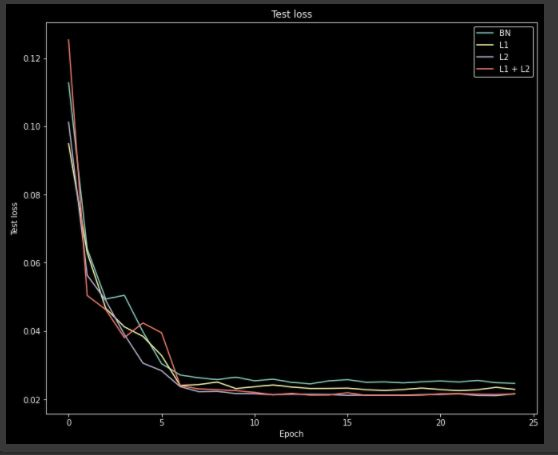			  

## Below is the test accuracy Plot for the above mentioned 4 scenarios with BN 

  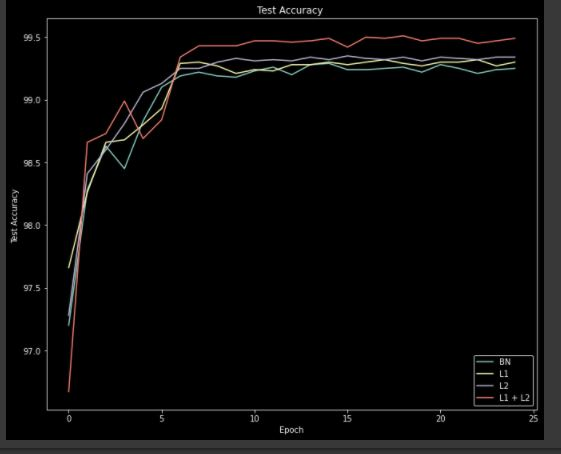			  

## Below is the test loss for plot the above mentioned 4 scenarios with GBN 

  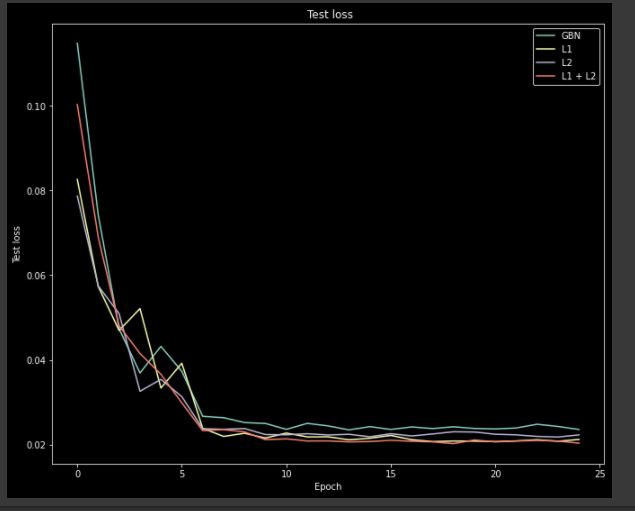			  

## Below is the test accuracy Plot for the above mentioned 4 scenarios with GBN 

  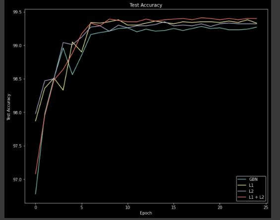			  

## Below is the 25 misclassified Image   with BN 

  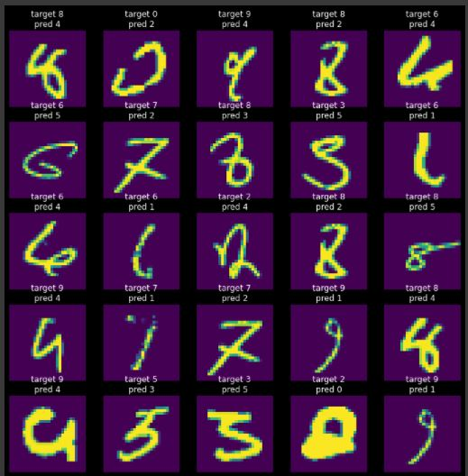			  

## Below is the 25 misclassified Image   with BN  + L1

  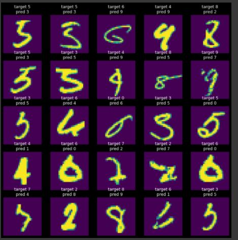			  

## Below is the 25 misclassified Image   with BN  + L2

  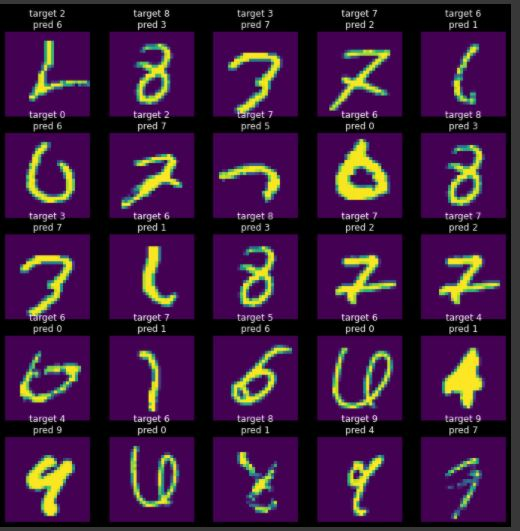			  

## Below is the 25 misclassified Image   with BN  + L1 & L2

  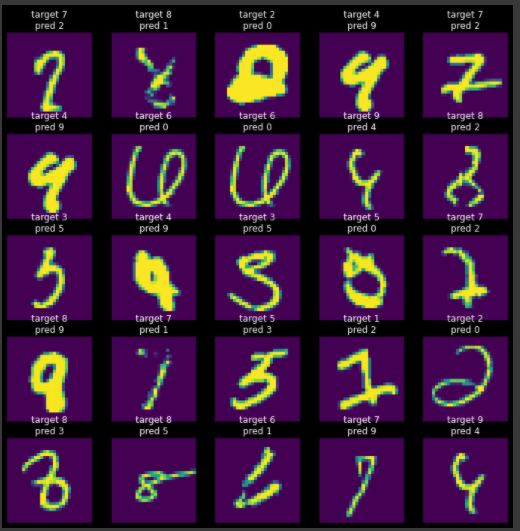			  

## Below is the 25 misclassified Image   with GBN 

  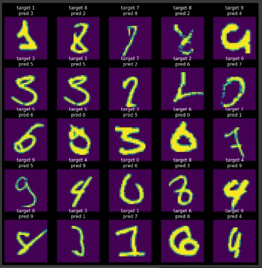			  

## Below is the 25 misclassified Image   with GBN  + L1

  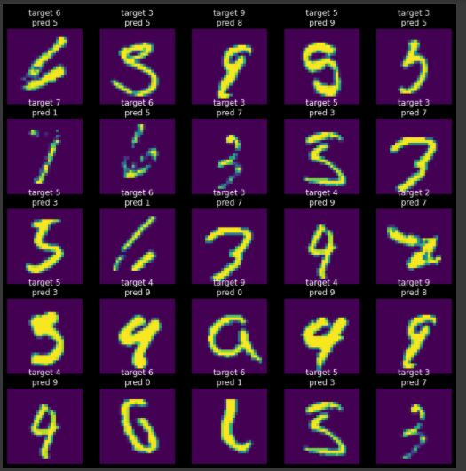			  

## Below is the 25 misclassified Image   with GBN  + L2

  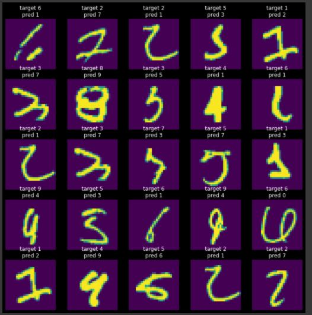			  

## Below is the 25 misclassified Image   with BBN  + L1 & L2

  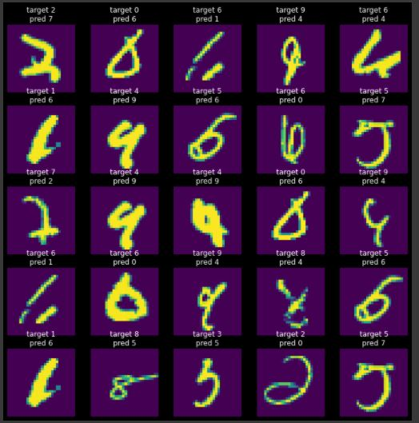			  

