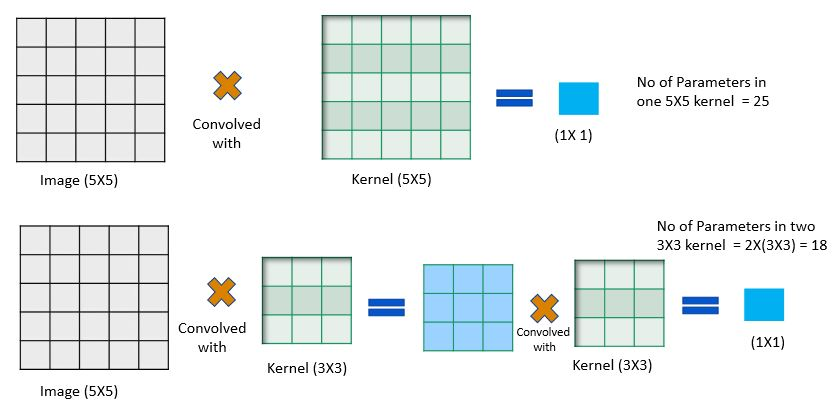
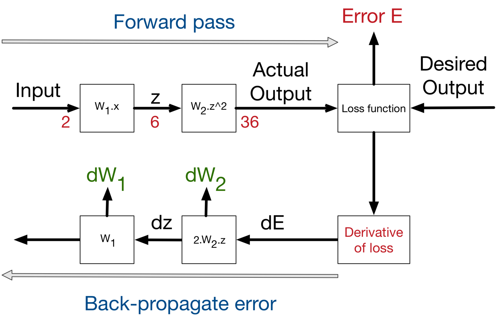

# EVA5 - WEEK 1 Assignment #

### 1. What are Channels and Kernels (according to EVA)? ###
***ANS :***
**Kernel** are the matrix of odd no size (usually 3X3) which is convolved with the image to extract certain features. 
 The values of the kernel and the symmetry is responsible for a particular type of feature. 
for example, the below 3X3 kernel can be used to produce a horizontal edge.
|-1|-1 |-1|
|:---:|:---:|:---:|
| 0 |0 |0 |
| 1 | 1 |1 |

__**Channels :**__
  Channels are the outcome of images convolved with a definite kernel. each Channel consist different features. for example, in the below Image we can see that it is a Image with different Alphabets present in it.

  			  

now in this image we can consider each alphabet as a feature. So each alphabet information can be stored in one channel. hence this image can be represented in 52 channels each representing a feature of small and capital letter in it.

### 2. Why should we (nearly) always use 3x3 kernels? ###
***ANS :*** 
below are the reasons for mostly using 3X3 kernel
1. Using an odd size kernel makes the kernel symmetric. 
2. To get a receptive filed of 5X5 we can have one stage convolution with 5X5 kernel. 
 to get the same receptive filed with 3X3 kernel we need to do 2 stages of convolution.
  Image(5X5) -> Convolved with 5X5 -> 1X1
  Image(5X5) -->Convolved with 3X3 --> 3X3 ->convolved with 3X3 -> 1X1

  			  

3. In recent time there are hardware’s which are accelerated for 3X3 kernel operations. 

### 3. How many times to we need to perform 3x3 convolutions operations to reach close to 1x1 from 199x199 (type each layer output like 199x199 > 197x197...) ###
***ANS :***
99 Times 
 
 199x199 > 197x197 > 195x195 > 193x193 > 191x191 > 189x189 > 187x187 > 185x185 > 183x183 > 181x181 > 179x179 > 177x177 > 175x175 > 173x173 > 171x171 > 169x169 > 167x167 > 165x165 > 163x163 > 161x161 > 159x159 > 157x157 > 155x155 > 153x153 > 151x151 > 149x149 > 147x147 > 145x145 > 143x143 > 141x141 > 139x139 > 137x137 > 135x135 > 133x133 > 131x131 > 129x129 > 127x127 > 125x125 > 123x123 > 121x121 > 119x119 > 117x117 > 115x115 > 113x113 > 111x111 > 109x109 > 107x107 > 105x105 > 103x103 > 101x101 > 99x99 > 97x97 > 95x95 > 93x93 > 91x91 > 89x89 > 87x87 > 85x85 > 83x83 > 81x81 > 79x79 > 77x77 > 75x75 > 73x73 > 71x71 > 69x69 > 67x67 > 65x65 > 63x63 > 61x61 > 59x59 > 57x57 > 55x55 > 53x53 > 51x51 > 49x49 > 47x47 > 45x45 > 43x43 > 41x41 > 39x39 > 37x37 > 35x35 > 33x33 > 31x31 > 29x29 > 27x27 > 25x25 > 23x23 > 21x21 > 19x19 > 17x17 > 15x15 > 13x13 > 11x11 > 9x9 > 7x7 > 5x5 > 3x3 > 1x1

### 4. How are kernels initialized? ###
***ANS :***
Initial weights of the kernel can be initialized in number of ways even with 0’s, 1’s or even random values, though it is better to use more complex methods  like Xavier and MSRA initializations whose values may seem random or arbitrary but they help in faster convergence of the network. 
So if your model doesnt converge, you might want to look at your initialization strategies.

### 5.What happens during the training of a DNN? ###
***ANS :***
During training, back propagation is used to train the weights, from output towards the input layers.

Weights (in any layer ) are increased or decreased by looking into the gradient of the succeeding layer by the optimizer. 

This change is proportional to the learning rate (we set) and also the position of the layer from the output layer/ gradient of the previous layer.

  			  

